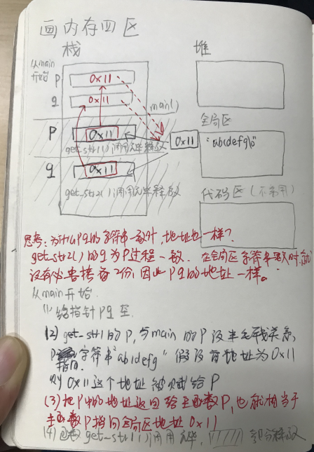
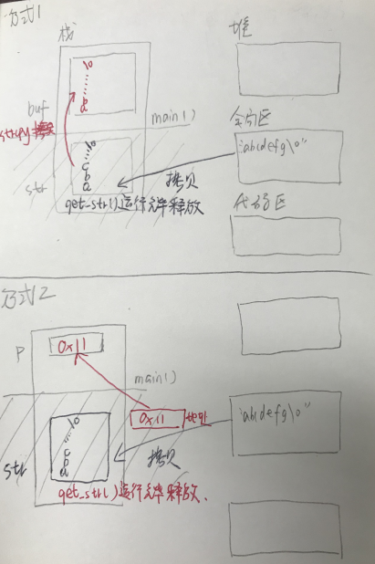
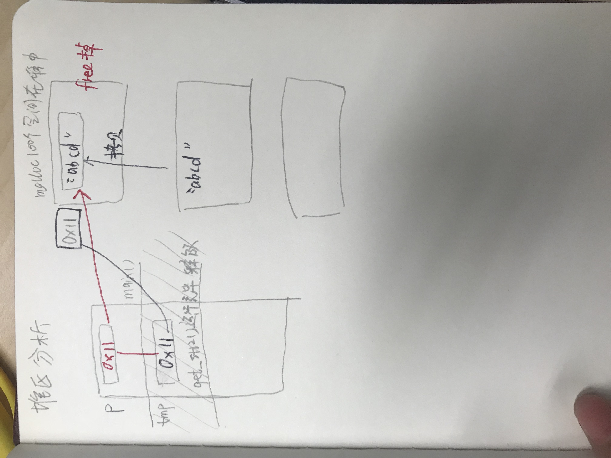

# 数据类型、变量、内存四区、指针
## 前言
1 写一个选择排序算法  
[选择排序算法](file1.c)  
出现的错误：error C2143: 语法错误 : 缺少“;”(在“类型”的前面)  
解决方法：  
```
	int a[] = {2,5,3,6,4};
	int n;
	n = sizeof(a)/sizeof(a[0]);//获得元素个数
	int i=0;
	int j=0;
	int temp=0;
```
c语言中注意要调整变量声明的位置，改为如下即可：  
```
	int a[] = {2,5,3,6,4};
	int n;
	int i=0;
	int j=0;
	int temp=0;
	n = sizeof(a)/sizeof(a[0]);//获得元素个数
```
2 对此算法进行函数封装  
[改进后程序](file2.c)  

对算法进行函数封装后，主程序语句变少，而且打印数组的时候只需调用函数print_array即可，不必使用for分别对排序前和排序后的数组进行输出了  
tips:数组形参退化为指针  
如果数组作为函数参数，数组形参退化为指针  
```
// 打印数组
/*
// 如果数组作为函数参数，数组形参退化为指针
// 下面四种写法都可以
// void print_array(int a[1], int n)
// void print_array(int a[], int n)
// void print_array(int *a, int n)
*/
void print_array(int a[10], int n)
{
	/*
	// 检验a是否为指针
	// n = sizeof(a)/sizeof(a[0]);//输出结果为1，因为此时a为指针，32位系统下占4个字节，64位占8个字节
	// 在主程序中的n则为5，因为彼时n是作为数组使用的
	*/
	int i = 0;
	for(i=0;i<n;i++)
	{
		printf("%d ",a[i]);
	}
	printf("\n");
}
```
## 数据类型（实质是固定内存大小的模具！）
1 基本类型（字节数）：  
 整形int（4）  
 浮点型float（4）、double（8）  
 字符型char（1）  
 空类型void  
2 结构类型（自定义类型）:数组（[]）结构（struct）类（class）联合（union）  
tips：数据类型只是模具，只有根据模具创建变量（实物）时，编译器才会分配内存空间  
指针类型在32位系统下占4个字节，在64位系统下占8个字节  
```
#include <stdio.h>
#include <stdlib.h>
#include <string.h>

int main()
{
	int a;    // 告诉编译器，分配4个字节
	int b[10];// 告诉编译器，分配4*10个字节

	printf("sizeof(a)=%d,sizeof(b)=%d\n", sizeof(a), sizeof(b));

	// 打印地址
	// 数组名字==数组首元素地址==数组首地址
	printf("b:%d, &b:%d\n", b, &b);// b:19920972, &b:19920972

	// b与&b的数组类型不一样
	// b数组首元素地址，一个元素四字节，+1就是加4个字节
	// &b数组首地址，一个数组4*10=40字节，+1就是加40个字节
	printf("b+1:%d, &b+1:%d\n", b+1, &b+1);// b+1:19920976, &b+1:19921012
	
	system("pause");
	return 0;
}
```
3 给变量起别名：typedef  
tips：1 typedef给数据类型起别名；2 配合结构体使用  
```
#include <stdio.h>
#include <stdlib.h>

typedef unsigned int u32;
// 在之后的程序中就用u32代替unsigned int 

int main()
{
	u32 t;// unsigned int 

	system("pause");
	return 0;
}
```
```
#include <stdio.h>
#include <stdlib.h>


struct MyStruct
{
	int a;
	int b;
};

typedef struct MyStruct2
{
	int a;
	int b;
}TMP;


int main()
{

	struct MyStruct m1;// 定义结构体变量，一定要加上struct关键字
	TMP m2; //typedef和结构体结合使用，定义结构体变量更简单

	system("pause");
	return 0;
}
```
4 void类型  
函数参数为空，定义函数时，可以用void修饰：int fun(void)在c语言中写上比较好，在c++中写不写无所谓  
函数没有返回值时，用void修饰：void fun(void)  
不能定义void类型的普通变量：void a,因为无法确定类型，则无法确定分配空间
可以定义void类型的指针变量：
```
void *p; // 万能指针，很常用，通常作为函数返回值和函数参数，很灵活
``` 
## 内存四区
主要掌握堆区，栈区，全局区，要会画内存四区图  
堆区heap：程序员手动分配和释放空间（new与delete，malloc与free）  
栈区stack：临时区，函数体中的变量  
全局区global：文字常量，全局变量，静态变量  
代码区code：操作系统管理  
1 全局区分析  
```
#include <stdio.h>
#include <stdlib.h>
#include <string.h>

char *get_str1()
{
	char *p = "abcd";//文字常量区->全局区
	return p;
}

char *get_str2()
{
	char *q = "abcd";//文字常量区->全局区
	return q;
}

int main(void)
{
	char *p = NULL;//pq在栈中

	char *q = NULL;

	p = get_str1();
	printf("p=%s, p=%d",p , p);

	q = get_str1();
	printf("q=%s, q=%d",q , q);

	printf("\n");
	system("pause");
	return 0;
}
```
上述代码的运行结果为  
```
p=abcd, p=10835772
q=abcd, q=10835772
```
思考：为什么pq的字符串一致时，地址也一样？  
  
2 栈区分析  
如下代码，分别使用方式1和方式2输出全局区文字常量“abcdefg”  
采用方式1可能输出“abcdefg”也可能输出乱码（这取决于解释器对strcpy是先赋值再释放还是先释放）  
采用方式2指针的方式进行输出，结果是乱码的  
```
char *get_str()
{

	char str[] = "abcdefg";
	return str;
}

int main(void)
{
	char buf[128] = { 0 };

	//方式1：使用strcpy进行拷贝
	//strcpy(buf, get_str()); //获取字符串拷贝到buf
	//printf("buf=%s\n,buf");

	//方式2：使用指针
	char *p = NULL;
	p = get_str();
	printf("p=%s\n,p");

	system("pause");
	return 0;
}
```
  
3 堆区分析  
```
char *get_str2()
{
	char *tmp = (char *)malloc(100);
	if (tmp == NULL)
	{
		return NULL;
	}
	strcpy(tmp, "abcd");
	return tmp;
}

int main(void)
{
	char *p = NULL;
	p = get_str2();
	if (p != NULL)
	{
		printf("p=%s\n,p");
		free(p);
		p = NULL;//将指针p重新赋值为NULL
	}
	system("pause");
	return 0;
}
```
  
注意：对malloc空间free，不是说这块空间没有值了，而是告诉系统，这块空间可以使用了，而指针也依然指向这块区域(p不为空），因此以防万一，将指针p重新赋值为NULL，如果对程序进行以下修改则出错（初学者常犯错误）  
```
	if (p != NULL)
	{
		printf("p=%s\n,p");
		free(p);
		//p = NULL;
		if (p != NULL)
		{
		    free(p);
		}
	}
```


